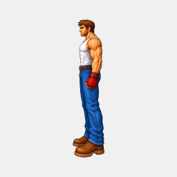
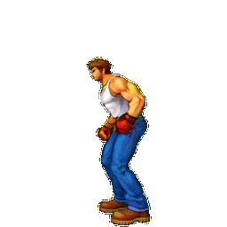
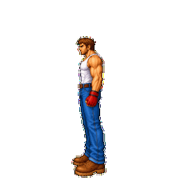
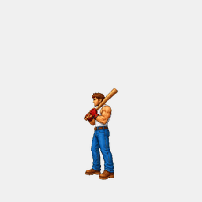
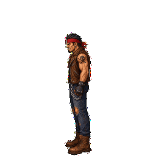
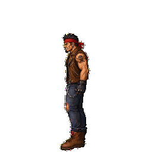
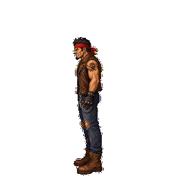
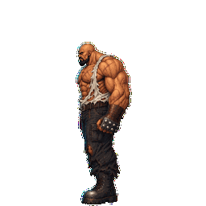
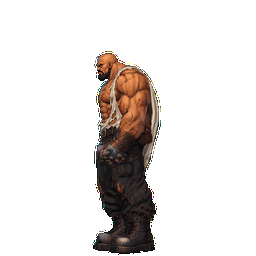
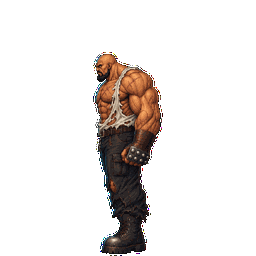

<div align="center">

# 🌆 Midnight Brawlers

A neon side-scrolling beat-'em-up built with Phaser, Vite, and TypeScript.


</div>

---

## About

Midnight Brawlers is a 2.5D street brawler. You move along a neon city street,
fight through waves of punks, smash destructible props, grab a dropped bat for
extra reach, and take down the boss at the end of the stage.

> **All assets in this project — character sprites, backgrounds, UI, hit FX,
> music, and sound effects — were generated using AI.**

## Run it

```bash
npm install
npm run dev      # start the dev server (http://localhost:5173)
npm run build    # type-check + production build
```

## Controls

| Action | Keys |
| --- | --- |
| Move | Arrow keys / WASD (up & down change lanes) |
| Run | Shift |
| Jump | Space |
| Punch | J |
| Heavy attack | K |
| Kick | L |
| Start / continue | Enter |

Chain punches together for a combo finisher. Pick up a bat dropped by an enemy
for longer reach and harder hits.

## Characters

**🥊 The Brawler (you)** — a fast street fighter with a full moveset: idle,
walk, run, jump, light and heavy attacks, kicks, and a bat variant. Chain
attacks into combos and launch enemies.

<table>
  <tr>
    <td align="center"><br><sub>idle</sub></td>
    <td align="center"><br><sub>run</sub></td>
    <td align="center"><br><sub>light attack</sub></td>
    <td align="center"><br><sub>kick</sub></td>
    <td align="center"><br><sub>bat attack</sub></td>
  </tr>
</table>

## Enemies

**🔪 Street Punks** — they approach, line up on your lane, and strike. Some
carry bats that hit harder, and they drop them when defeated so you can grab
one. Each punk shows a small health bar above its head.

<table>
  <tr>
    <td align="center"><br><sub>idle</sub></td>
    <td align="center"><br><sub>walk</sub></td>
    <td align="center"><br><sub>attack</sub></td>
  </tr>
</table>

**👑 The Boss** — a slow, heavy brute with far more health and a punishing
smash attack. He enters with a chest-pound taunt and gets his own health bar.

<table>
  <tr>
    <td align="center"><br><sub>idle</sub></td>
    <td align="center"><br><sub>walk</sub></td>
    <td align="center"><br><sub>chest pound</sub></td>
  </tr>
</table>

## Gameplay

- **Belt-scroll movement** across a wide neon street with depth lanes and jumping.
- **Wave-based arenas** — the camera locks at each gate until you clear the
  enemies, then opens up to the next section.
- **Destructible props** — trash cans, oil drums, and crates break apart when hit.
- **Combo combat** with light/heavy/kick attacks, launchers, and a bat pickup.
- **Boss fight** to finish the stage, with stage-clear and game-over states.

## Tech

- [Phaser 3](https://phaser.io/) — game framework
- [Vite](https://vitejs.dev/) — dev server and bundler
- [TypeScript](https://www.typescriptlang.org/)

## Project layout

```text
previews/            # animated character previews (used in this README)
public/assets/
  street-brawler/    # hero spritesheets
  street-punk/       # punk enemy spritesheets
  street-boss/       # boss spritesheets
  stage/             # buildings, sky, street, and destructible props
  ui/                # splash key art + HUD atlas
  fx/anim/           # hit FX spritesheets
  items/             # bat pickup
  audio/             # music + sound effects
  levels/            # level layout JSON
src/
  main.ts            # Phaser game config + scene list
  game/              # scenes, fighters, input, HUD, and gameplay logic
```
